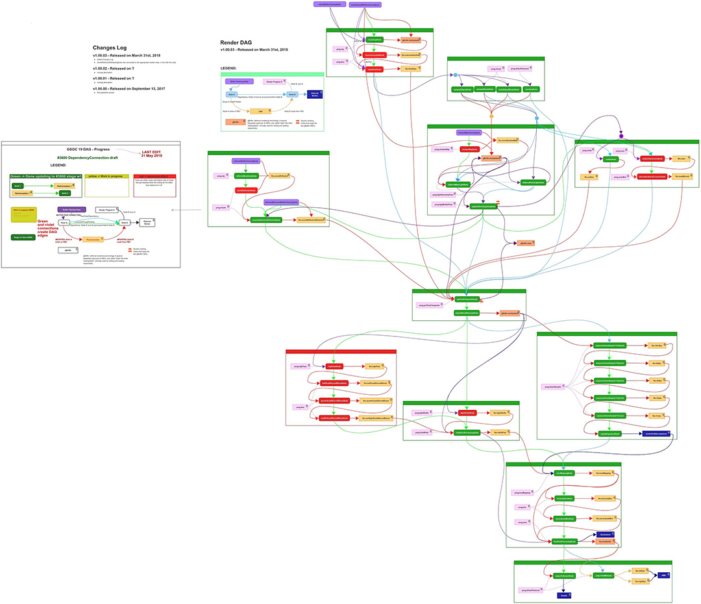
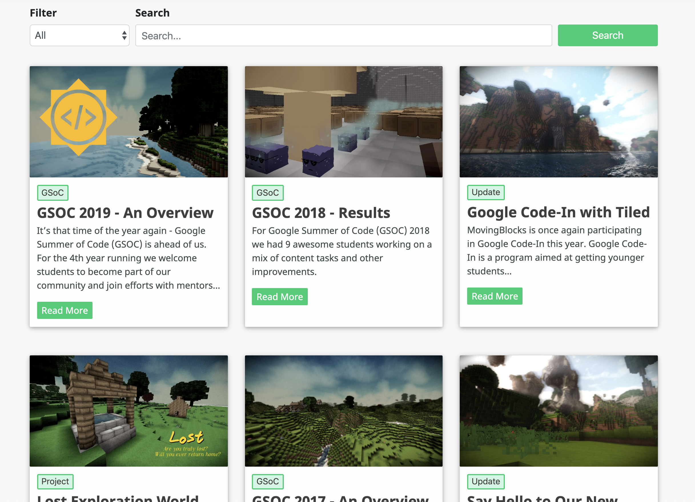
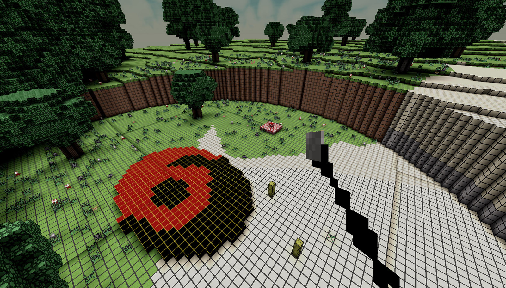
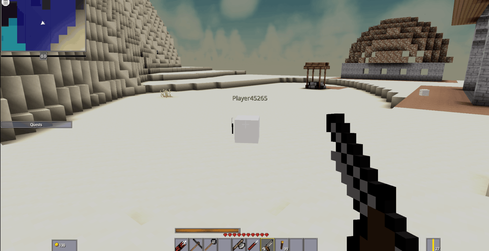

A few months ago, we introduced [this year's Google Summer of Code students and their projects](/blog/gsoc-2019-an-overview). Now that the summer is over, it's time to summarize what has happened. But first of all: we are very happy to thank all our nine students for their contributions to [The Terasology Foundation], and we want to congratulate them for successfully finishing a Summer of Code!

> _Just a short reminder of what [GSOC] actually is:_
> _in a 3-month program sponsored by Google, students from all over the world are motivated to join open-source organizations and thrive on real-world software development challenges._
> _Organizations and students find each other, interact directly, and build and improve FOSS projects._

A video game might seem to offer a restricted range of topics to work on, but quite the contrary is the case.
Our students were working on different areas all over our code base, including additional content and game modes as well as improving user experience and tinkering with under-the-hood technologies.
Let's visit them one-by-one ...

## Technology

{:figure: style="height:24rem;display:block;margin-left:auto;margin-right:auto;padding:0.5em;"}

Technical parts that reside in the depth of Terasology’s implementation may not be (immediately) visible to players but are crucial for all the individual gears of the project to interlock.
The first two projects we want to highlight fit into this very technology-heavy category.

The best part about _David S_' project on enhancing the **Render DAG** is that we don't see it.
That might sound weird at first, but making the rendering architecture modular should ideally not change its behavior.
As a result, we can connect frame buffers freely to rendering nodes at runtime.
In case you ever wondered what such a graph looks like - here you go 🤓

Continuing our game dev buzz word bingo: next up is an AI project on **Collective Behavior**.
_casals_ was clever enough to find a suitable project close to his research topic, but that does not mean it was all easy cruising.
Over the course of three months the concept of Behavior Trees was extended to be also applicable to groups.
To showcase the development, the WildAnimals module was extended (oh deer 🦌).
Tutorials are updated and examples provided, so we hope to see our mobs stepping up a bit.

## UX and Tooling

When talking about game development one should not forget about the tasks that
are not focused on graphics and rendering, but put the player in the center:
How to start the game?
How to manage versions and updates?
What modules are trending?

Student _Priydarshi Raj_ put his hands on the **Launcher 4.0**, starting with a UI redesign.
The topic soon derailed a bit and ended up being focused on bundling the Java Runtime and providing a re-implementation of the game downloader and package manager.
This means that the launcher is now self-contained - no hassle with debugging your local Java version anymore!
However, we have to wait a bit longer for the complete dark UI theme.

The **Module Showcase Website** by _majordwarf_ made up for the missing UI overhaul in the Launcher, though, and provides some visual novelty.
Initially, it was scoped to provide a website to make our modules discoverable.
It ended up with a wider scope, drafting an overhaul for our website with the module showcase section just being one part of it.
In the future, this should help players to keep track of the vast amount of modules and extensions (201 right now!)  that are available for Terasology.

## Content

Another one of our busy student bees during this year's Google Summer of Code was _Cameron McWilliams_.
As the main part of his **Apiculture** project he created a whole new family of species that can be integrated in Terasology gameplay: bees! 🐝
Bees are associated with a specific species, have a fixed lifespan and can have offspring.
As some species of bees are not as common as others, the other part of his project enables a player to bee (pun intended) a scientist and take a dive into the hive of genetics.
By use of the extractor and injector tool, the player can extract gene samples and inject them into other bees, allowing to beed... sorry, breed... rare species with especially desirable traits.

Health restoration (being healed) and regeneration (healing) used to be the same thing for a long time in Terasology.
But now that summer is over and _E. Aakash's_ **Health Overhaul** is in place, things are different.
The game now has a different cycle for each of these two effects, allowing to associate them with different events and individually configure or even disable them, depending on the game mode.
In addition, he documented his take on possible implementations for a point pool as the backbone for point-based systems, such as hunger, thirst and - who would have thought it possible - health.
Naturally, this list is not complete and grows as per the imagination of our module developers, e.g. air (underwater), mana, stamina, etc.

## Game Modes

_darshan3_ took it on him to develop the visual and lore-based ideas of **Light and Shadow** into an independent capture-the-flag-style game mode.
He built an arena in which the teams can battle for the precious flag with the help of towers or weapons such as the Spades Staff that repels or the Diamonds Staff that stuns enemies.
Players can also see enemies drawing closer on the now multiplayer-enabled minimap.
Soon, players can futhermore barter resources to get new items in the (currently almost completed) markets.
Loving statistics, we also approve of the game over screen, listing kills and deaths for each player! 👍

Our brand new game mode **Metal Renegades** was tackled by no less than two students - naturally on different ends of the project.
This proved beneficial for both the progress of the game mode development and the students' skill to find the right scope for their work (and communicating it).

_AndyTechGuy_ busied himself with the behavior of faction-affiliated NPCs as well as needs for both NPCs and players alike.
The in-game cities are now brought to life with scared (run, forrest, run! 🏃‍♂️), hostile (this is sparta! 😤), friendly (I, I follow, I follow you 🤗) or simply straying (where is Lady, you tramp? 🐶) NPCs.
And as soon as they go to sleep in the evening, the nocturnals come out to play 😉
All of the differently behaving NPCs feel the same needs as a now player might: hunger and thirst.
They even get lonely and seek a fellow citizens proximity - naturally only if they are of the same faction... else: spartaaa!

<!-- {:height="50%" width="50%"}  -->

Meanwhile, _Mayant Mukul_ worked on connecting dynamically created cities with rails that even run locomotive carts (tchuff tchuff 🚂).
Moreover, he added weapons such as pistols and gatlings (pew pew pew) and introduced currency with which every player can now not only fill his or her brand new wallet, but also buy items by trading with the NPCs.
But watch out, whatever you carry around with you: if you die, you don't take it to the grave with you - it drops onto the ground for anybody to pick up.

---

> _The way students report their progress is determined by the student and their mentors. There is no policy applying to
> all participants, that's why you might find blogs, forum reports for others, or only technical discussion and
> documentation for one or another student. We encourage this diversity and are always excited about the format of
> project documentation._
>
> _The project summaries and descriptions are partly taken from the student's proposals._

<!-- References -->
[GSOC]: https://summerofcode.withgoogle.com/
[The Terasology Foundation]: https://summerofcode.withgoogle.com/organizations/4777549354237952
[DestSol]: http://destinationsol.org/
[Light and Shadow]: http://forum.terasology.org/threads/las-light-and-shadow-art-discussion.762/
[basic world]: https://trello.com/c/HySvX0oY/106-andytechguy-metal-renegades-world
[interaction of players]: https://trello.com/c/ai7v5Q16/107-wabadump-metal-renegades-multiplayer
[Apiculture]: https://forum.terasology.org/threads/gsoc-2019-apiculture.2267/
[Restoration 100]: https://forum.terasology.org/threads/health-overhaul-gsoc-2019.2263/
[showcase]: https://forum.terasology.org/threads/gsoc-proposal-draft-module-showcase-website.2237/
[launcher]: https://praj.home.blog/2019/05/25/gsoc-2019-the-project-ill-be-working-on/
[collective behaviour]: https://trello.com/c/9mWFmr17/112-casals-collective-madness
[Rendering DAG]: https://trello.com/c/vJr1Qh5I/109-dave2s-dag