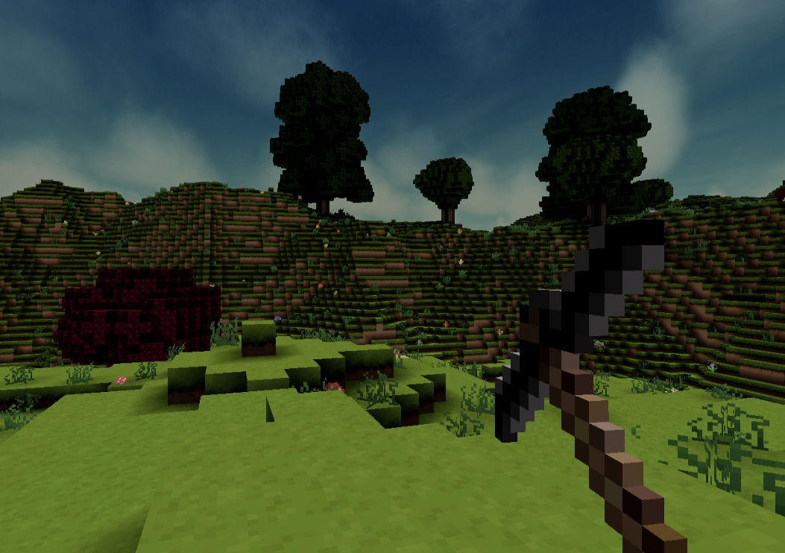
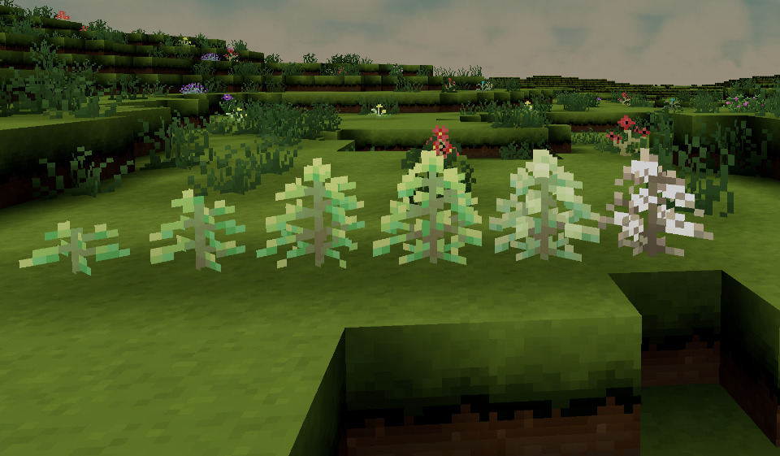

_And now for something completely different: **TeraSaturday**, a weekly update post about all the neat stuff that has been going on in
 the world of Terasology! Half blog, half changelog, completely cool. Probably. I mean, there aren't any laser sharks...
 or laser raptors... or even laser eye surgery. But hopefully it will still meet your coolness expectations._

---

* The biggest Terasology news this week is that it marks the end of this year's Google Code-In, and a big _thank you!_ 
goes out to everyone who participated, students and mentors alike! It's been great helping everyone experiment and learn
over the past couple of months, and I certainly hope to see everyone more in the future.

## New Features (The Fun Stuff)

* If you've been making new block shapes lately, you've probably become familiar with the challenges of our old Blender
plugin. It's not compatible with the current version of Blender, it's tricky to install, and getting things to rotate
properly can be messy. Like making a banana smoothie without a lid. And so you'll probably be glad to hear that Pollend 
and I have released the first beta version of a brand new [Blender Block Shape Plugin] for Blender 2.8. 

* It can be installed normally from Blender's addon menu, it can import and export all the basic engine shapes without 
getting confused about which way is up, and it is 100% laser-shark-free, guaranteed. There is no such guarantee about 
bugs, however. So if you spot one, make sure you jump on a table and scream at us to squish it. _(Or just [create an
issue] in the GitHub repo. We're more likely to hear you that way.)_

---

* Leaves and grass have looked a little sad and dead since the BiomesAPI update last May removed block colorization. 
It was an unfortunate side-effect of progress; since biomes were no longer part of the engine, the engine could not
rely on the biome to tell it what colors the grass should be. But vibrant plants are sacrificed no more! They have
returned, relying upon the humidity and temperature directly instead of the biome.

---

* That is not the only way in which the basic flora has improved this week. [Cotton] textures in CoreAssets have been
replaced with brand new art from TheStygianHawk.

---

* New contributor askneller is working on better cave generation; as an intermediary step, world generating rasterizers
 (the systems that place the specific blocks) [can depend on another rasterizer][MovingBlocks/Terasology#3825] which 
 must run first. This is important, because if you try to decorate your caves before you have any caves to decorate, 
 you're going to wind up with an empty cave and a visit from the Time Police for violating the laws of cause and effect. 

---

## Bugfixes and Optimizations (The Nerdy Stuff)

* Adrijaned has made improvements to the [asset loading system][MovingBlocks/Terasology#3589], including lots of 
documentation in an area that definitely needed more of it. Even for clever devs like _(ahem)_ yours truly, figuring out
how to use code without any documentation is often bitter and confusing. Like those little soap-flavored mints on hotel
pillows. Always comment your code, kids. Don't make soap-flavored mints.

---

* BenjaminAmos has done similar work over in the [Sensors] module. So if you're into creating monsters that watch from
the shadows, or traps that activate when you step on them, or raptors that perform laser eye surgery when they see a
shark, now you can proceed while knowing what you're doing. _(Knowing **why** you're doing it is something you'll have
to figure out on your own. We can't help you there, sorry.)_

---

* DarkWeird has [streamlined the chunk loading process][MovingBlocks/Terasology#3804] for worlds that have already been 
generated, which should be noticeably better at loading more of the world faster in multiplayer games when players are 
far apart, or if you happen to be playing Terasology on a potato or a toaster. _(Unfortunately, we do not, at this time, 
support playing Terasology on toasted potatoes. Potato toasters, however, are fine.)_

---

* Pollend has [optimized the Discord Rich Presence integration][MovingBlocks/Terasology#3821], which reduces Terasology's
 overall CPU usage by up to 2%. _(Note for future developers: increasing a counter to 5000 every millisecond instead of
 just waiting 5 seconds is... not fast. So don't do that. Please. Your CPU will thank you. Not literally, because that
 would be creepy. It'll thank you in a non-verbal metaphorical way. By working faster. That is all.)_
 
---
 
* [Windows XP users][MovingBlocks/Terasology#3823] might be able to play Terasology again, thanks to sladyn98. There's
just one problem... none of us has a Windows XP system lying around anymore to fix it. _(Not even the people with potatoes 
and toasters.)_ So if you or a loved one has been diagnosed with Microsoft Windows XP, you may be entitled to confirmation.
Please, try it out and let us know if it works.

---

Thus concludes the first TeraSaturday changeblog. Hopefully, despite the absence of flashy lights and fierce creatures, 
your thirst for coolness has been satiated. _(If not, I recommend a low-calorie sports drink.)_ Enjoy the game, and I'll 
be back for another update next week!

<!-- References -->
[Blender Block Shape Plugin]: https://github.com/MovingBlocks/BlenderAddon/releases/tag/v2.0.0-beta
[create an issue]: https://github.com/MovingBlocks/BlenderAddon/
[MovingBlocks/Terasology#3589]: https://github.com/MovingBlocks/Terasology/pull/3589
[MovingBlocks/Terasology#3802]: https://github.com/MovingBlocks/Terasology/pull/3802
[MovingBlocks/Terasology#3804]: https://github.com/MovingBlocks/Terasology/pull/3804
[MovingBlocks/Terasology#3821]: https://github.com/MovingBlocks/Terasology/pull/3821
[MovingBlocks/Terasology#3823]: https://github.com/MovingBlocks/Terasology/pull/3823
[MovingBlocks/Terasology#3825]: https://github.com/MovingBlocks/Terasology/pull/3825
[Sensors]: https://github.com/Terasology/Sensors/pull/4
[Cotton]: https://github.com/Terasology/CoreAssets/commit/5e94cef5ef278a8dd7e93321689882493a97968d