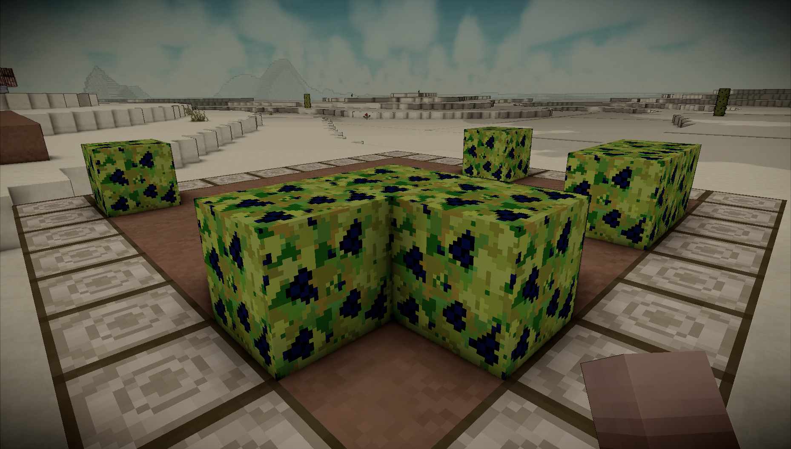
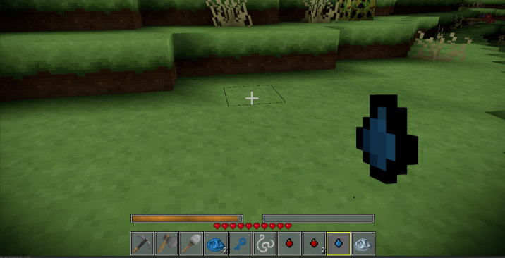
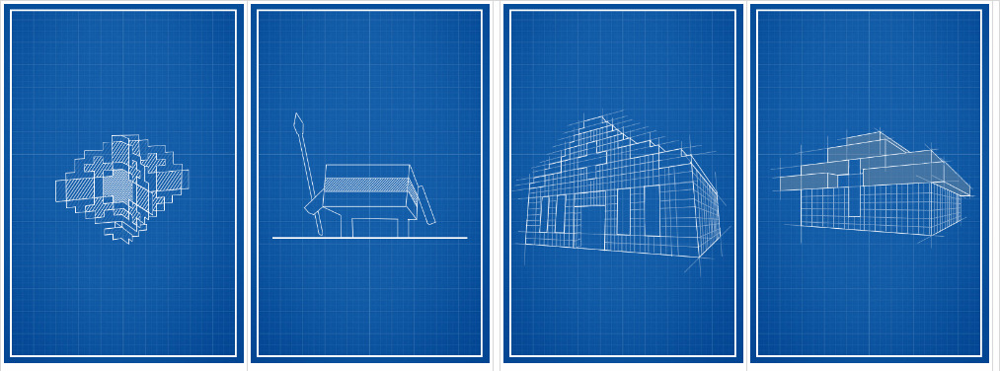

In our 5th year participating in the Google Summer of Code (GSOC), we [welcomed](gsoc-2020-an-overview) six students to our community that joined efforts with mentors and other contributors to make Terasology even more awesome!
Two more students are doing GSoC projects for Coduino under Terasology as the "umbrella organization":
<blockquote class="twitter-tweet">
Our 2 GSoCers under <a href="https://twitter.com/codeuino?ref_src=twsrc%5Etfw%22%3E">@codeuino</a> have passed their first evaluation and are moving towards more betterment of their project. Here are the short videos covering their work before the first phase<a href="https://twitter.com/AselPeiris1?ref_src=twsrc%5Etfw%22%3E">@AselPeiris1</a> - <a href="https://t.co/iKO2GHwyOK%22%3E">https://t.co/iKO2GHwyOK</a><a href="https://twitter.com/Rupeshkrj2?ref_src=twsrc%5Etfw%22%3E">@Rupeshkrj2</a> - <a href="https://t.co/LckGUC8Oyd%22%3E">https://t.co/LckGUC8Oyd</a> :grinning::raised_hands::grinning:
&mdash; Jaskirat Singh (@jaskirat626) <a href="https://twitter.com/jaskirat626/status/1279485175785635840?ref_src=twsrc%5Etfw%22%3E">July 4, 2020</a></blockquote> 

**Quick Reminder:** [GSOC](https://summerofcode.withgoogle.com/) is a 3-month program sponsored by Google that motivates students from all over the world to join open-source organizations and thrive on real-world software development challenges.
Organizations and students find and interact with each other directly and on a social and community-driven basis.

Now that our students are mid-way through their GSOC projects, a lot of progress is already visible.
Let's take a look at what each of our students has already achieved during the first half of the project 🔍

# Metal Renegades: Refining Gameplay
## - by _AndyTechGuy_

👉 [Progress Report (forum.terasology.org)](https://forum.terasology.org/threads/weekly-updates-for-metal-renegades-refining-gameplay.2319/)

To refine the "Metal Renegades" gameplay, Andy revisited it and all its issues.
The first bunch to defect from the defective side were performance issues, swayed by reducing buffer outflow and city growth rate.
Next, filling your thirst was made more realitic by receiving a water cup from the marketplace to use it on a well instead of getting it from the well itself. Futhermore, wells are now no longer a infinite resource, but can dry out.

To improve the chances of the player surviving this rough place called the old west, the cities now include small patches of farming ground with fruit and vegetables growing on them.
These fruit and vegetables can fill (depending on the sort) either hunger, or thirst, or both.

After dealing with the player's needs, the non-player characters got a tad more personality with their randomized names and different sizes.
And to enable even more players to fall in love with these gooey creatures, Andy is currently working on fixing a bunch of multiplayer issues 🛠

# Biome-specific Content Enhancements for Terasology
## - by _ktksan_

👉 [Progress Report (forum.terasology.org)](https://forum.terasology.org/threads/biome-specific-content-weekly-updates.2322/)

Biome-specific content enhancements are impacts of a biome's characteristics on the player, which ktksan started out introducing by adding various effects that extreme climate like snow and desert can have on the player.
By following Terasology's "Event-Component-System" (ECS) approach, they introduced new Hypothermia and Hyperthermia components the play will get in extreme climate conditions.
These components negatively affect the player, for instance by slowing, hurting or weakening them.
A very nice visible effect that was added as well, was a "visible breathing" particle effect in cold areas:

On they went with adding a "Body Temperature System" that reacts on climate information such as ambient temperature and in case of it growing very high or low can result in the player becoming hypo- or hyperthermic.
As this is a rather complex topic, that required a lot of discussion, brainstorming and review cycles, it is not fully complete yet (!).
In the meantime of all that communicative effort, ktksan continued to make progess on their project by adding materials that are dropped and can be used for crafting also newly added equipment that helps the player in extreme climatic situations.
To only name a few examples for such items: Sand slippers to avoid heat burn and slowdown when moving through hot, loose sand or a woolen vest that warms the player in cold areas.

Along the way, ktksan also found, fixed or implemented several related, but theoretically out-of-scope issues and showed their motivation to contribute to Terasology beyond their project's scope.
One good example for these efforts is adding a filling bar to fluid containers to improve the user experience when working with different fluid levels:

# Genome Expansion
## - by _Vedant Shroff_

👉 [Progress Report (forum.terasology.org)](https://forum.terasology.org/threads/genome-expansion-project-weekly-updates.2323/)

The "Genome Expansion" project is a top-secret research project about module merging, plant breeding and nutrition research.
Vedant's initial experiments showed that breeding algorithms can now be registered in "Genomes" with _traits_ 👨‍🔬.
Base algorithms for continuous and discrete traits were added and are ready to be used.

The next series of experiments proved the theory behind scientifically changing the color of items - also known as tinting.
No players, animals or fruit were harmed in the process.

Based on these preliminary studies and by integrating with the state of the art work of jellysnake et al. such as "EdibleFlora" and "SimpleFarming", for instance by adding events, the next stage of the project could commence.
In their laboratory, Vedant secretly developed a process to breed seeds, so that the Terasology world would be allowed to enjoy such marvelous wonders as blue raspberries 🍓

Naturally, these genetic alterations don't come for free: The conducted research showed, that the genetics of edibles (food and drink) now affect their impact.
This and the other experiments called for a lot of unit testing in the process 🕵️‍♂️

# Terasology Game Hud, Graphics Improvement & Gameplay Guide
## - by _Stefania Mak_

👉 [Progress Report (forum.terasology.org)](https://forum.terasology.org/threads/ui-ux-project-weekly-updates.2321/)

Stefania's project is all about improving the user interface (UI) and user experience (UX) and bringing Terasology and its gameplays closer to a distinct identity and style. For this, they started out with [collecting references](https://docs.google.com/document/d/1bsLSXFFPDvMwemMR3ZqTxqqf0Nk73v28DbdmhpuuS_I/edit?usp=sharing) from various games with respect to HUD (Head-Up Display) structure and design.
To get more accustomed to how Terasology HUD elements work and can be altered, Stefania took the task selection screen of Terasology's "Master of Oreon" (MOO) and gave it a whole new look:

Although there's currently only the default blueprint image shown in the task selection screen, Stefania created a bunch more, to be [integrated by any interested party](https://github.com/Terasology/MasterOfOreon/issues/73).

After this first familiarization task, the focus went to Terasology's Capture-the-Flag gameplay "Light And Shadow" (LAS).
Here again, Stefania showed a lot of creativity with mock-ups for the different gameplay-specific screens.
Two of the ideas were already implemented: Enlarging the health bar and changing the quickslot bar from the classic Minecraft-like horizontal orientation and central position to a less building-focused vertical orientation at the right side of the screen:

Changes to the dialogue screen with the fool are currently in the works, while alterations of questing HUD elements, game over, stats overview and gameplay-independent screens are still outstanding.

# Interactive Journey in Terasology Contributions
## - by _Pratham Sahasrabhojane_

👉 [Progress Report (forum.terasology.org)](https://forum.terasology.org/threads/tutorial-journey-website-updates-gsoc-2020-theshubham99.2305/)

The goal of Pratham's project is to develop an exploration website that introduces users to contributing to Terasology. 
Users are led down a path of questions and answers where the final goal is to narrow down the interest and goals of the user. This should narrow
down what the user reads and covers from the game documentation, what modules to look at, and what features of the engine to start with. 
This should make the game more approachable to individuals that want to contribute to the project. 

Pratham initially started mocking up the layout of the site and working out the features that would be appropriate to the site. The final
stack was built in React and a JSON config file is used at the moment to setup the navigation of questions displayed on the site. There
has been some cross talk between Stefania and Pratham on UI/UX and small improvements here and there such as adding additional padding. 
Pratham at the moment has been working on improving the functionality of the site. There is some basic debate in regards to adding
a tutorial to that would explain each section of the site. 

<iframe width="560" height="315" src="https://www.youtube-nocookie.com/embed/9evOvbQrksQ" frameborder="0" allow="accelerometer; autoplay; encrypted-media; gyroscope; picture-in-picture" allowfullscreen></iframe>

# Converting "Destination: Sol" systems to use ECS
## - by _Isaac lichter_

👉 [Destination: Sol Blog](http://destinationsol.org/)

👉 [Progress Report (forum.terasology.org)](https://forum.terasology.org/threads/refactoring-destination-sol-to-use-ecs-architecture.2325/)

Isaac's journey of porting "Destination: Sol" to the [Entity-Component-System "Gestalt"](https://github.com/movingblocks/gestalt) that is the base for Terasology as well started out with handling _health_ and _damage_ via the ECS.
The next stage was introducing events for _physical contact and force_ which resulted in events like `ContactEvent`, `ImpulseEvent`, and `ForceEvent`.
Naturally, things need to be cleaned up from time to time, so Isaac introduced new events for the _removal_ of entities to be used within "Destination: Sol".

The next stage took our student to render-land to work out how to draw the graphics based on the concept of entities introduced by the ECS.
Like every exciting journey, this one as well didn't go without running into issues.
However, Isaac managed to defeat the foe of serialization troubling them with respect to a class for physics handling and continue making progress.

