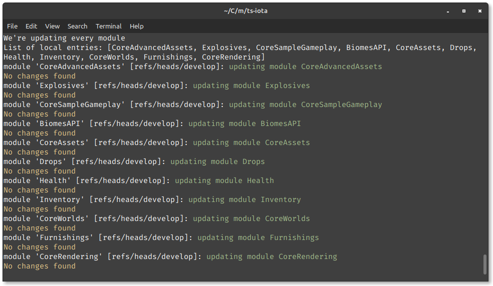
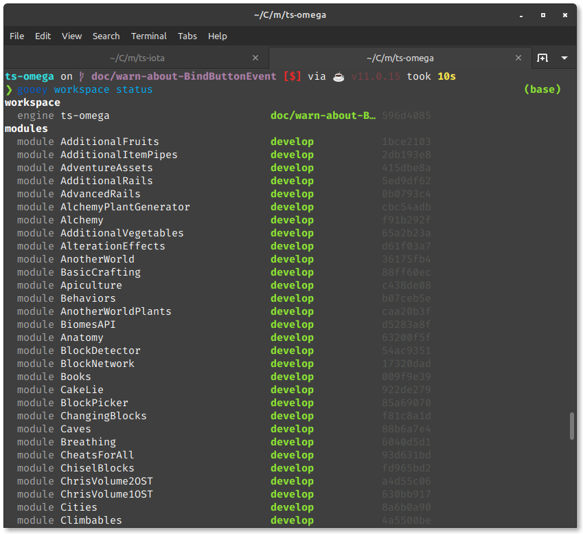
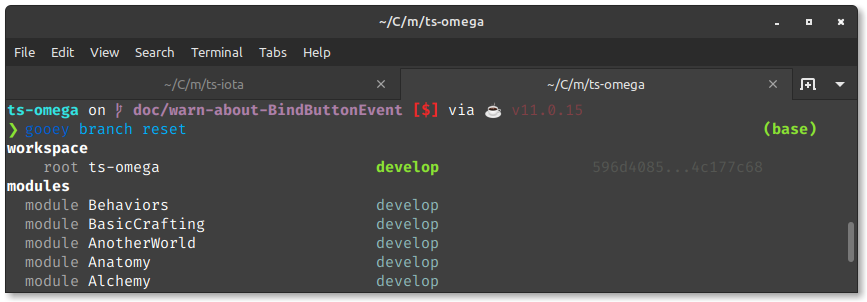
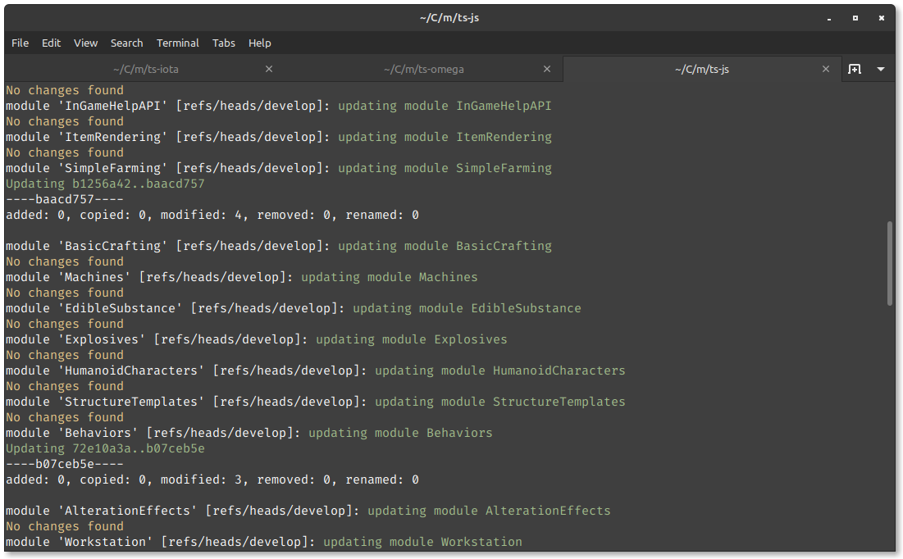

_This is a personal experience report, sharing thoughts and insights into my workflow._

It has been some time since our last update, and it also has been some time since my last contribution to Terasology.
We had these quiet periods before, where everyone is charging up their batteries, learning new things, or just taking a break. 

Coming back after such a long time can be hard - even if it seems quiet on a first glance, a lot of things might still have happened.
And indeed: There have been hundreds of commits spread over our repositories since the [last blog post](/blog/tera-spotlight-gsoc-2021-final-show-tell/) in September 2021. 
We had two releases since then, with [v5.3.0 / Alpha 23](https://github.com/MovingBlocks/Terasology/releases/tag/v5.3.0) being the latest one.

Let me share how I updated my various workspaces when coming back after some time of absence...

## Updating my Workspaces

To start fresh I wanted to reset my workspaces to a clean state - discard any uncommitted changes (at this point I don't have any clue what they might have been about anyways) and pull the latest changes from upstream.
It's not a hard task and I've done it uncountable times before, but not everybody might be that familiar with the tools and little helpers available to assist with that task.

### Updating my Iota Workspace

To bring my Iota workspace up to speed I used the `groovyw` utility tool that is shipped with the engine repository.
You can run it easily via the provided wrapper scripts, that is `./groovyw` on Linux or `./groovyw.bat` on Windows.
It comes in handy to initialize a workspace with a specific set of modules, fetch additional modules, or update everything via git.
Our [Contributor Quick Start Guide](http://terasology.org/Terasology/#/Contributor-Quick-Start?id=set-up-your-terasology-development-workspace) also references it for the initial setup.

But today I'm only interested in updating all my modules in the workspace.

```
groovyw module update-all
```

This command triggers a run over all the modules in `modules/` and attempts to update them. 



This took about 5 seconds to go over the 11 modules of our Iota distribution.
Seemingly my modules were all on `develop` and up to date, so there was nothing else to do here.

Note, that this only updates the modules. 
I had to update the engine itself manually by checking out the desired branch (`git switch develop`) and pulling in the changes from upstream (`git pull`).

Another thing to keep in mind: `groovyw module update-all` only attempts to update whatever branch is checked out at the moment - it does not _reset_ onto the default branch, and it might just fail if there are uncommitted changes, for instance.

### Updating my Omega Workspace

For my Omega workspace I used my little CLI tool [node-gooey](https://github.com/skaldarnar/node-gooey) to inspect the current status.

```
gooey workspace status
```

With nearly 150 modules checked out the inspection alone takes about 10 seconds, but I got a good overview whether there are any changes in a module and which branch they are on.



Following that, I did a _hard reset_ of everything, including the engine itself, to the respective default branches (that is, in all cases here, `develop`):

```
gooey branch reset
```

Most modules were still up to date and there was nothing to be done.
Only one module and the main engine repo were changed, and my workspace should be good to go again. 

The complete run took about 7s to update all modules.



### Updating my Josharia's Survival Workspace

Yes, I do have a dedicated workspace with all the modules required to work on _Josharia's Survival_, one of the main game modes. 
While it is possible to just work with one big Omega workspace, dedicated workspaces per game mode are really handy when working on features for a specific module line-up. 
I can leave the workspace in a work-in-progress state with experimental features without affecting other game modes.

With roughly 60 modules checked out, this workspace is about a third of a full Omega workspace. 
The status check with `gooey workspace status` shows a couple of repositories in blue, indicating that they are behind their upstream counterpart. 

As everything is already on branch `develop`, I gave `groovyw` another chance to compare its performance against the `gooey` CLI:

```
groovyw module update-all
```

As expected, there were no changes found for most modules, and for those lacking behind I could see that they were updated.
The whole run took 13 seconds, followed by a very quick `git pull` to also update the engine itself.



A final status check showed that everything is green - another workspace ready.
I finished my round of updates with `gooey branch reset` on my other workspaces for _Light and Shadow_ and _Metal Renegades_ and should now be ready to get my hands on the code again.

---

It is worth noting that `groovyw` does not only work for modules, but also for libraries (`lib`), facades (`facade`) and meta repositories.
In addition, there are more features, like creating a dependency graph for Graphviz in the [DOT language](https://graphviz.org/doc/info/lang.html).
To learn more have a look at `groovyw usage`.

On a related note, there is also a PR ([#4805](https://github.com/MovingBlocks/Terasology/pull/4805)) attempting to rewrite `groovyw` into a more powerful CLI tool for managing Terasology workspaces.

Happy Coding!