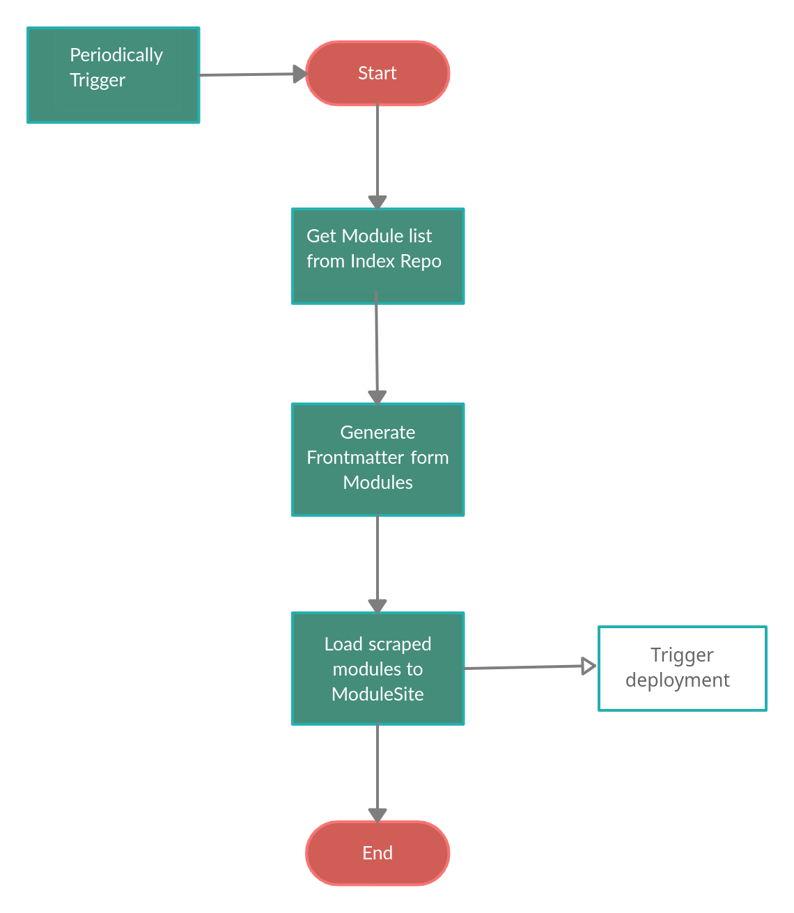

# Module Generation Automation

The automation focuses on gathering information about modules listed as part of the `omega` distro in the [Index repository](https://github.com/Terasology/Index/blob/master/distros/omega/gradle.properties) and exhibits the generated information on the [ModuleSite](https://github.com/MovingBlocks/ModuleSite).
Both steps are performed in a [Jenkins pipeline](https://www.jenkins.io/doc/book/pipeline/).

The pipeline will be run periodically as a cron job, so that the ModuleSite is up-to-date with any changes in module information.

### File Structure

```
├── Jenkinsfile           - Jenkins pipeline text file
├── scrape.py             - File to scrape and sort modules and Non modules repository and to collect require information
├── frontMatter.py        - File to generate frontmatter form scraped modules
├── loadModules.sh        - supporting bash script to perform git operations
```

### Module Generation Diagram



## Collecting Data

At the starting stage of the pipeline, the "scrape" script sends API calls to GitHub to fetch all required information from the Index repository, i.e. `module.txt`, and optionally the `README.md` and a cover image.
If `README.md` or the cover image are not available, we will fallback to a default image and a default readme text.
Afterwards, the "frontmatter" script prepares the collected information for display on the ModuleSite.

## Loading Modules

This stage simply clones the ModuleSite, copies the modules directory into the cloned ModuleSite and performs git operations to push the changes. All of these actions are performed by `loadModules.sh`.

## Clean Workspace

At last, the workspace is cleared so that we don't run into errors next time when the pipeline is executed. The same process is repeated periodically.
