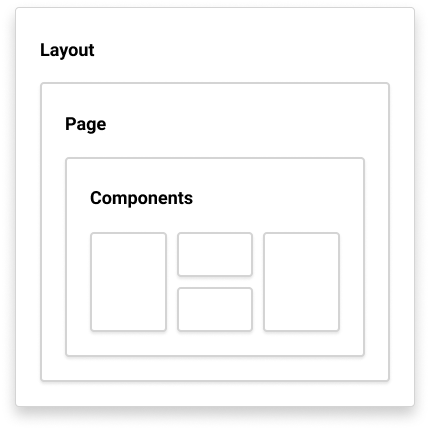

## Project Structure (Only includes important files)

```
├── blog            - Markdown files for the blog posts
├── data            - Meta data for the website
├── modules         - Markdown files for the modules data
├── scripts         - Scripts to deploy the website to GitHub and Render
├── src             - Most of the website's actual code as explained ↓
│   ├── components  - React components we see throughout the website¹
│   ├── layout      - The structure of the website, may be interpreted as a skeleton which is later filled with react components to bring it to life
│   ├── pages       - Gatsby uses the pages directory to generate all the pages we see throughout the website²
│   ├── template    - Not all pages needs to hard-coded, Gatsby uses templates to programmatically generate pages ³
├── static          - Images, Logos, robots.txt etc

├── ...
├── gatsby-node.js  - Gatsby's website generating pipeline
└── ...
```

---

**¹ :** Pages can consist of two types of data, static and dynamic. If the data is static (like the homepage, about page), it can be hard-coded but if some elements require a state to be maintained to be reused on a different part of the website we can extract it out by building them as components and using by importing them as needed. So things like a search bar, search results, a header that is used on multiple pages are extracted into their components.

> **⚠️ Note:** Right now, even things like about page and homepage have their components but we can develop them as their own page without needing components.

---

**² :** As stated Gatsby uses this directory to generate pages, any filed place here will generate into the page using the file name. As most of the pages have the same structure [Header > Body > Footer] we use a predefined layout to reduce redundancy and have a central point to modify our layout. Gatsby consumes the layout, data, and components if any to generate the pages.

This is how a page generates or a relationship looks,



---

**³ :** We'll be constantly adding new blog posts, modules to the website. Creating their pages manually is a tedious task. So we let Gatsby figure out where the files are and then generate those pages automatically.

Imagine this website a conveyor belt (a pipeline), Gatsby goes step by step to generate the website, one of the initial steps is processing all the markdown files inside the project directory (which are inside /blog and /module) directory and index them. Gatsby provides us with an API to modify how the build pipeline works.

Navigate to [LN50](https://github.com/MovingBlocks/ModuleSite/blob/master/gatsby-node.js#L50) of gatsby-node.js and you will find a `createPages` function, which is called after all of the markdown files are processed. Gatsby doesn't know how to differentiate between them, so we use front-matter to filter them. Front-matter is the header of the markdown files filled with metadata. For eg:

```
---
posttype: "blog"
title: "Say Hello to Our New Website!"
description: "If you have visited our website before you might notice something different now. Yep, we have a new design!"
---
```

Here we use 3 GraphQL queries,
[`markdownQueryResult`](https://github.com/MovingBlocks/ModuleSite/blob/master/gatsby-node.js#L55-L79) > To list down all markdown files and generate the blog and module pages. It also scans front-matter to identify whether it is a blog post or module and gives it an appropriate slug/URL.

[`blogQueryResult`](https://github.com/MovingBlocks/ModuleSite/blob/master/gatsby-node.js#L89-L157) > To generate the /blog, /blog/2 ..... /blog/n pages to index all of our blog posts.

[`moduleQueryResult`](https://github.com/MovingBlocks/ModuleSite/blob/master/gatsby-node.js#L159-L221) > To generate the /blog, /blog/2 ..... /blog/n pages to index all of our blog posts.
For the above two queries there are some math operations going on, this is to ensure we generate a page with 6 blog/modules cards and then move onto generate a new page for pagination.

From [LN129-140](https://github.com/MovingBlocks/ModuleSite/blob/master/gatsby-node.js#L129-L140) and [LN192-204](https://github.com/MovingBlocks/ModuleSite/blob/master/gatsby-node.js#L192-L204) we are generating a JSON file. This files are later consumed by the search-bar and are used to dynamically generate new cards based on search queries.
